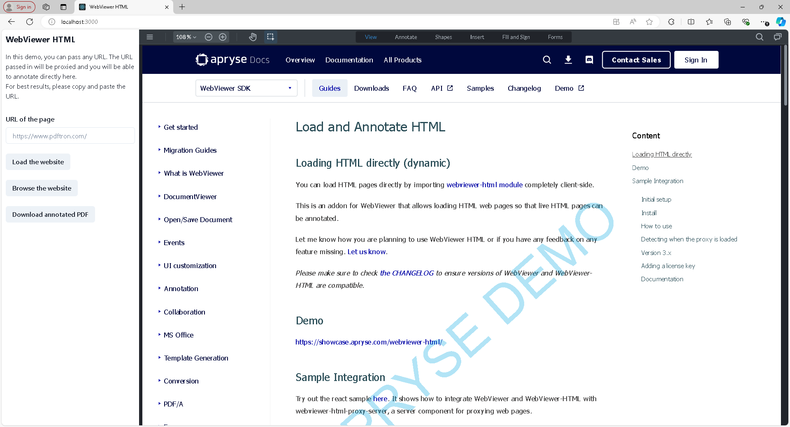

# WebViewer HTML Annotation from Proxy Server 

[WebViewer](https://docs.apryse.com/documentation/web/) is a powerful JavaScript-based PDF Library that is part of the [Apryse SDK](https://apryse.com/). It allows you to view and annotate PDF files on your web app with a fully customizable UI.

The sample uses [WebViewer HTML](https://docs.apryse.com/api/html/) in a client web application to load web pages and annotate live HTML by simply providing the URL. This way you can preserve all the animations and any interactive content. The viewer component is created in the client app as a [shared instance](https://docs.apryse.com/documentation/web/faq/react-global-instance/) through a React [context](https://react.dev/learn/passing-data-deeply-with-context).

The pages are served from a hosted [HTML Proxy](https://docs.apryse.com/api/html-proxy-server/) Node.js Express Server that proxies the website from the URL.

**Please make sure to check the [CHANGELOG](https://docs.apryse.com/documentation/web/guides/html/changelog/) to ensure versions of WebViewer and WebViewer-HTML are compatible.**




## How it works

1. Client app makes the request to the HTML Proxy server.
2. The HTML Proxy server serves the endpoint `/pdftron-proxy?url=someurl.com`, 
3. From the `url` query parameter, we start requesting all the website dependencies (HTML, CSS, JS, images).
4. The server responds back with proxied resources.
5. WebViewer then renders out live HTML that can be annotated.

## Disclaimer

This project is experimental. A proxy server is used to serve webpage assets. This is done to get around various security issues when loading a webpage in an iframe. This works for a good amount of pages but there are many exceptions. If you have a subset of web pages that you would like to support then we recommend forking this repository and making the necessary fixes. We won't be making those changes because it would likely result in other pages failing.

## Install

```
gh repo clone ApryseSDK/webviewer-html-annotate-proxy
cd webviewer-html-annotate-proxy
npm install
```

Both `client` and `server` packages are initialized as workspaces in this repo's `package.json`. Running the `npm install` script will install all the dependencies needed by the main repo and the two subfolder's respective `package.json` files.

## Run

In Visual Studio Code or from a Command Prompt window, preview the app in `localhost` with an `npm` command. 

```
npm start
```

Alternatively, you can also install and run client and server separately. Though both must be running and able to communicate with each other.

## WebViewer APIs

* [@pdftron/webviewer API documentation](https://docs.apryse.com/api/web/global.html#WebViewer__anchor)
* [@pdftron/webviewer-html](https://docs.apryse.com/api/html/module-@pdftron_webviewer-html.html)
* [@pdftron/webviewer-html-proxy-server](https://docs.apryse.com/api/html-proxy-server/module-@pdftron_webviewer-html-proxy-server.html)

## Video Demo

You can watch a [video](https://youtu.be/pamn97LMD6s) to see a demo and walkthrough of the project.

## License

For licensing, refer to [License](LICENSE).